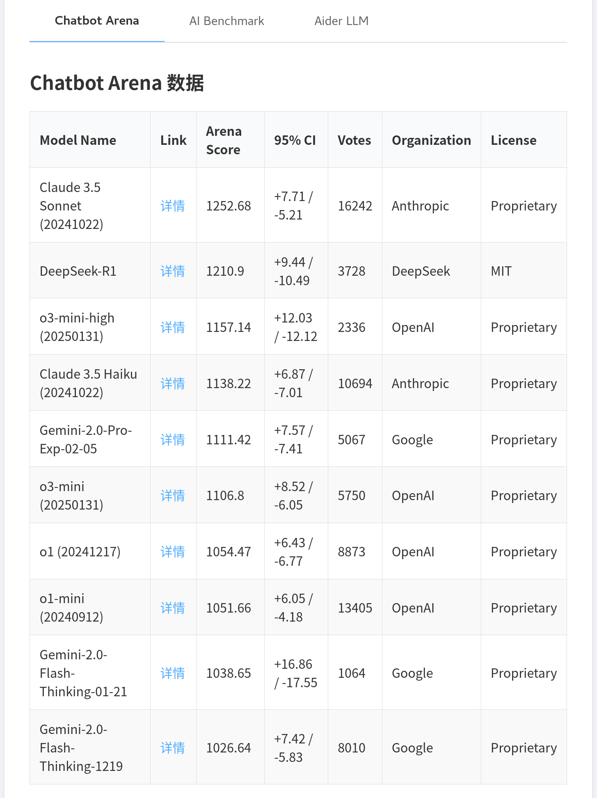

# 大模型基准测试数据抓取与展示

## 项目简介

本项目旨在抓取多个大模型基准测试网站的数据，并将其展示在一个前端页面中。项目包括以下功能：
1. 从 Chatbot Arena、AI Benchmark 和 Aider LLM 网站抓取数据。
2. 将抓取的数据转换为 JSON 格式并保存。
3. 在前端页面中展示抓取的数据，支持选项卡切换查看不同来源的数据。
4. 汇总热门基准测试数据并展示。

## 文件结构

- `scrape_data.py`：包含抓取数据的脚本。
- `index.html`：前端页面，用于展示抓取的数据。
- `chatbot_arena_data.json`、`ai_benchmark_data.json`、`aider_llm_data.json`、`popular_benchmark_data.json`：抓取的数据文件。

## 环境依赖

- Python 3.7+
- `crawl4ai` 库
- `openai` 库
- 一个支持异步的 Web 爬虫库（如 `aiohttp`）

## 安装与使用

### 1. 克隆项目

```bash
git clone https://github.com/liugddx/awesome_llm_benchmark.git
cd awesome_llm_benchmark
```

### 2. 安装依赖

```bash
pip install -r requirements.txt
```

### 3. 配置 OpenAI API 或者兼容的 API 密钥

在 `scrape_data.py` 文件中，替换 `your key` 为你的 OpenAI API 密钥或者兼容的API密钥。

### 4. 运行数据抓取脚本

```bash
python scrape_data.py
```

### 5. 启动本地服务器查看前端页面

你可以使用任何静态文件服务器来查看 `index.html` 文件



## 数据展示

前端页面 `index.html` 包含四个选项卡，分别展示从 Chatbot Arena、AI Benchmark、Aider LLM 和热门基准测试汇总抓取的数据。页面加载时会自动抓取并展示最新的数据。

## 主要benchmark汇总

- Chatbot Arena (https://openlm.ai/chatbot-arena/)
提供了一个实时对话平台，用户可以在这里直观地比较不同大模型在对话场景中的表现与响应质量。
- LM Arena (https://web.lmarena.ai/leaderboard)
展示了各大语言模型在多项任务上的排名和性能数据，帮助用户快速了解模型在不同场景下的综合能力。
- AI-Benchmark (https://ai-benchmark.com/ranking_deeplearning_detailed.html)
详细列出了深度学习中各硬件设备和模型的训练、推理性能指标，是进行硬件对比和算法性能评估的重要参考平台。
- SuperGLUE Benchmark (https://super.gluebenchmark.com/leaderboard)
聚焦自然语言理解任务，排行榜展示了当前各大模型在 SuperGLUE 基准测试中的最新成绩，反映模型在 NLP 任务中的表现。
- MMLU-Pro Leaderboard (https://huggingface.co/spaces/TIGER-Lab/MMLU-Pro)
由 TIGER-Lab 在 Hugging Face Spaces 搭建的平台，专注于展示大模型在 MMLU-Pro 基准测试中的实力和排名，衡量模型的多任务学习能力。
- Aider.Chat Leaderboards (https://aider.chat/docs/leaderboards/)
汇总展示了不同大模型在多项评测标准下的表现，直观的数据展示帮助用户快速获取各模型的性能对比信息。